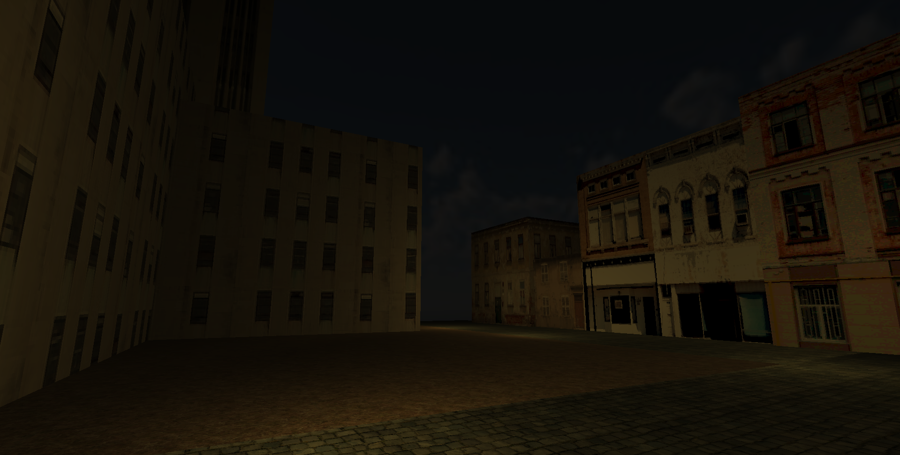

# **Immersive Engine**

A 3D game engine made for virtual reality (VR) applications.

##### Features:

* Engine core written in C++.
* 3D rendering using the OpenGL API.
* VR integration through OpenXR.
* A component based system for objects.
* A clean and modular object oriented design.

